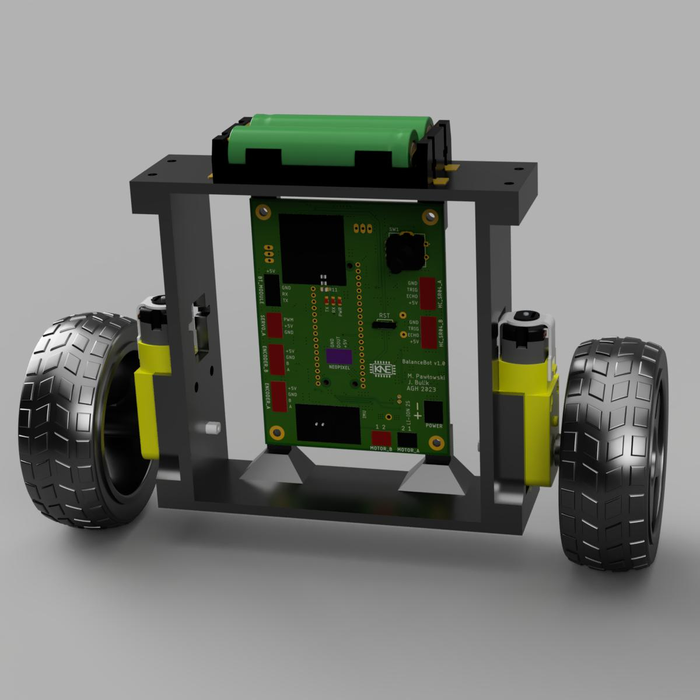
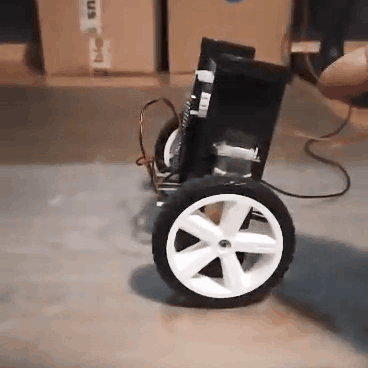

# BalanceBot

RPi Pico based self balancing robot developed as academic project on AGH UST

**NOTE:** This project is still WIP (Work In Progress)

## Overview
A goal was to create two-wheel robot with ability to self-balance. 

|  |  |
|-|-|

### Hardware
- 2S LiIon/LiPo battery pack
- custom PCB
- RPi Pico (dual core ARM Cortex M0+)
- DRV8833 H-Bridge (much more efficient than popular L293) 
- 2x DFRobot SJ01 120:1 DC Motor with magnetic encoder
- MPU-6050 6-axis IMU (accelerometer + gyroscope)
- 2x HC04 ultrasonic distance sensor
- SSD1306 OLED display + EC11 rotary encoder 

### Software
Code was written in C language using *Raspberry Pi Pico SDK*.

Self-stabilization algorithm is based on measuring vehicle's tilt angle using accelerometer and gyroscope measurements. The angle is calculated using *complementary filter*. Idea of the filter is to estimate angle avoiding errors from gyroscope low frequency components and accelerometer high frequency components.

Next stage of controller consists of 3-level cascade of PID controllers:

|name|set point|input|output|description|
|-|-|-|-|-|
|pid_speed|target_robot_speed|current_robot_speed|target_angle|calculate angle needed to reach target_robot_speed|
|pid_imu|target_angle|current_angle|target_motor_speed|calculate motor speed needed to reach target_angle|
|pid_motor_a|target_motor_speed|current_motor_a_speed|motor_a_power|calculate power (PWM duty cycle) needed to achieve current_motor_a_speed|
|pid_motor_b|target_motor_speed|current_motor_b_speed|motor_b_power|calculate power (PWM duty cycle) needed to achieve current_motor_b_speed|

This may seem little unintuitive on first sight, but makes robot able to balance "in place" instead of drifting to either side. Such algorithm was possible to implement thanks to motor encoders. Working principle is explained pretty well [on Husarion blog](https://medium.com/husarion-blog/fresh-look-at-self-balancing-robot-algorithm-d50d41711d58), where we got the idea from. Thanks a lot for publishing it!

PID coefficients can be set via OLED GUI, which can be navigated using rotary encoder. Big thanks to David Schramm for the [pico ssd1306 library](https://github.com/daschr/pico-ssd1306)

All of above runs on a single core. There is a plan to use second core for wireless communication and further expand abilities of the robot 

### PC App
There is a [python script](PC/main.py) included, which implements plotting data received on serial port. It is simple and unoptimized, but was really helpful during debugging and tuning of complementary filter and PID controllers.
 
## Further development
- design new frame to lower center of mass -> lower moment of inertia
- replace heavy 18650 LiIon battery pack with light LiPo 
- improve IMU measurements by using MPU-6050's interrupt
- fine-tune PIDs
- implement driving and remote control
- implement obstacle detection using ultrasonic sensors

## Attribution
- *slightly modified* [SSD1306 library by David Schramm](https://github.com/daschr/pico-ssd1306)
- idea of PID cascade from [husarion/self-balancing-telepresence-robot](https://github.com/husarion/self-balancing-telepresence-robot) and [Husarion Medium blog](https://medium.com/husarion-blog/fresh-look-at-self-balancing-robot-algorithm-d50d41711d58)
